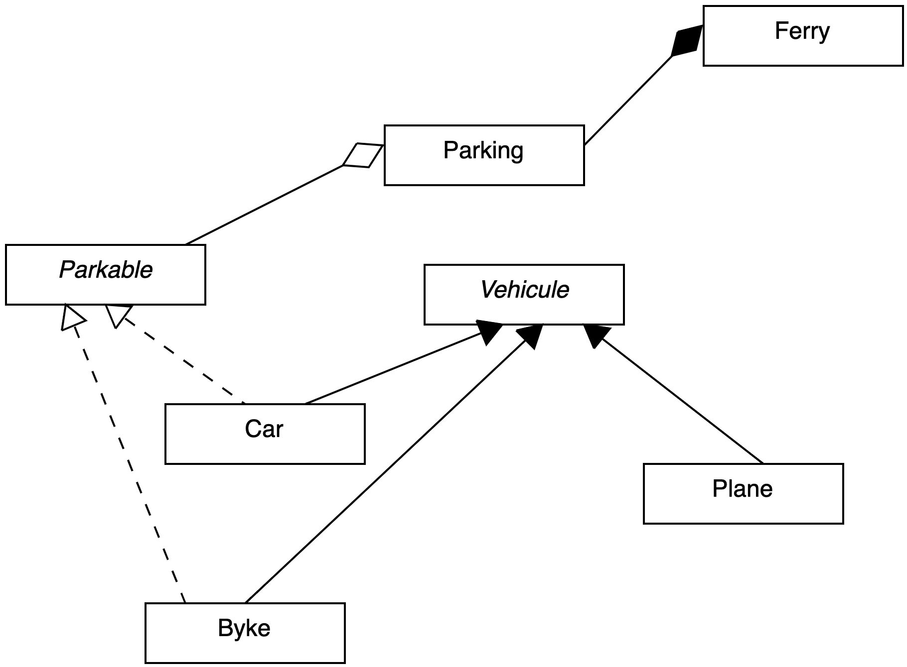

## Exercice Parking (synthèse)

Créez un dossier Parking avec l'architecture de dossiers et fichiers suivante. Vous pouvez utiliser les classes Vehicule, Car et Plane de l'exercice Park précédent. Définissez un namespace Park de haut niveau (composer.json) :

```txt
Parking/
    src/
        Vehicule.php
        Car.php
        Plane.php
        Bike.php
        Parkable.php
    app.php
    composer.json
```

Vous suivrez le diagramme de classes suivant pour vous aidez à implémenter les classes :



1. Créez les classes **Bike**, **Car** et **Vehicule** puis, créez la classe **Parking**. Un objet de type "Bike" ou "Car" peut se garer dans un parking (objet de type Parking). Ces deux classes sont également de type Vehicule (héritage).

Définissez maintenant l'interface **Parkable** :

- Contrats :
    - park(address:string, place:string)
    - pay(price:float)

La classe Parking possèdera les méthodes suivantes :

- addPark : cette méthode permettra d'ajouter un Objet Parkable
- removePark : cette méthode permettra de "sortir" un Objet Parkable
- count : compte le nombre de mobile(s) garé(s)

*Vous pouvez si vous le souhaitez utiliser la classe SplObjectStorage (clé/valeur) pour enregistrer les objets dans le parking.*

Faites en sorte que seules les classes Bike et Car puissent se garer dans un Parking :

```php
require __DIR__ . '/vendor/autoload.php';

use Park\Car;
use Park\Plane;
use Park\Bike;
use Park\Parking;

Car::setSpeed(180);
Plane::setSpeed(890.5);

$brompton = new Bike('brompton');
$kia = new Car('kia');

$airbus = new Plane('airbus 320');

$parking = new Parking();
$parking->addPark($brompton);
$parking->addPark($kia);
try {
    $parking->addPark($airbus); // exception

} catch (TypeError $e) {
    echo $e->getMessage();
}

echo $parking . "\n";
```

4. Créez la classe Ferry. Elle possède un Parking, c'est également un objet de type Vehicule.

```php
$ferry= new Ferry($parking);

$telsa =new Car('tesla');
$parking->addPark($telsa);
echo $parking . "\n";

```

5. Implémentez une méthode getAll ou __toString dans la classe Parking. Cette méthode affichera le détail des objets qui sont garés dans un parking.


